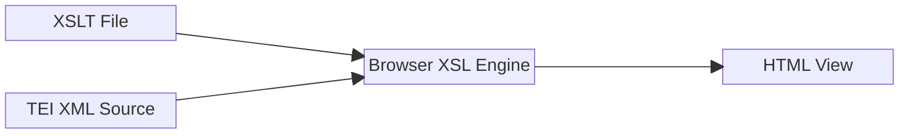

# The Vita of Joseph Busnaya

This is a small [TEI XML] project I launched in 2022.

It hosts a reconstruction of the preface of _"The Life and the Teaching of Joseph Busnaya"_ by John Bar Kaldun, with a [critical apparatus] encoded in [TEI XML].

There are two variants of the text:

- [complete](https://rpbarczok.github.io/life_all_variants/edition.html) (with punctuation, difficult optics) ([source](https://raw.githubusercontent.com/rpbarczok/rpbarczok.github.io/refs/heads/master/life_all_variants/preface-basic.xml))
- [light](https://rpbarczok.github.io/life_not_all_variants/edition.html) (without punctuation, easier optics) ([source](https://raw.githubusercontent.com/rpbarczok/rpbarczok.github.io/refs/heads/master/life_not_all_variants/preface-basic.xml))

The reconstruction is based on the following versions of the source:

- V1 = Città del Vaticano, Bibliotheca Apostolica Vaticana, - Vat. sir. 467, first hand
- V2 = Città del Vaticano, Bibliotheca Apostolica Vaticana, - Vat. sir. 467, second hand
- C = Cambridge, University Library, Or. 1315
- M = Birmingham, Cadbury Research Library, Ming. 66
- W = Washington D.C., Catholic University of America, Ms Syr. - 11
- B = Bagdad, Chaldean Patriarchy, No. 193
- D = Trichur, Library of the Metropolitan of the Church of the - East, Syr. 7
- E = Ernakulam, Major Malankara Archbischop's House, 7.4
- F = Cambridge, University Library, Oo. 1.29

The project provides an XSL transformation ([source](https://raw.githubusercontent.com/rpbarczok/rpbarczok.github.io/refs/heads/master/life_all_variants/edition.xsl)) to make the [TEI XML] _"readable"_, while still being able to display the critical apparatus when one clicks on a text passage.

The application works serverless: The transformation is performed in your browser and can be applied to other [TEI XML] encoded sources:

Feel free to use the transformation for your project according to the [GPL].

[TEI XML]: https://en.wikipedia.org/wiki/Text_Encoding_Initiative
[critical apparatus]: https://en.wikipedia.org/wiki/Critical_apparatus
[GPL]: https://www.gnu.org/licenses/gpl-3.0.html
